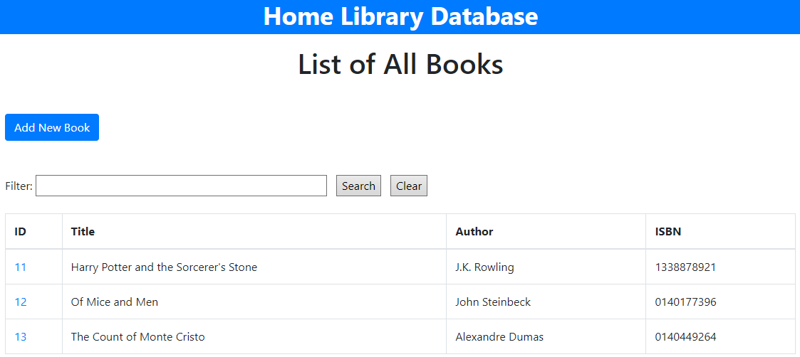
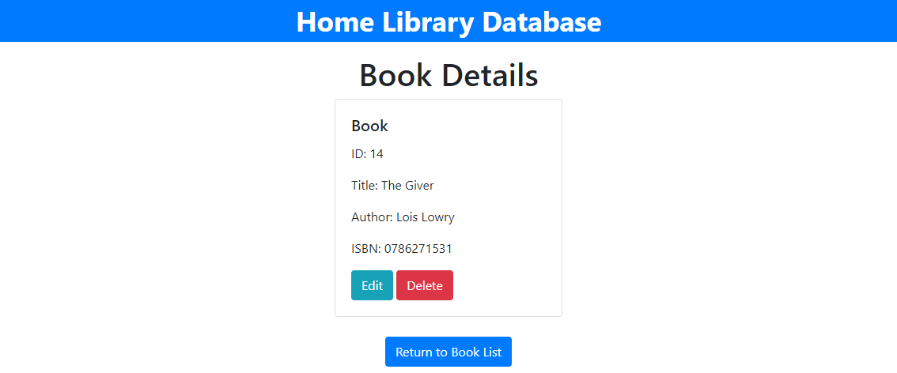
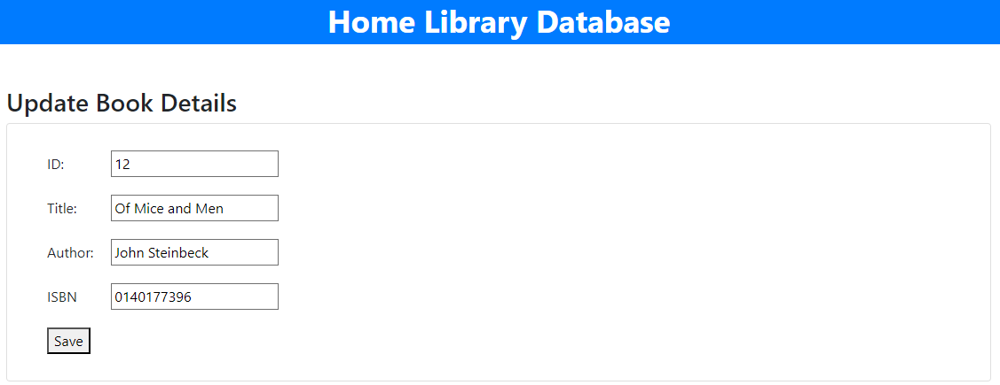
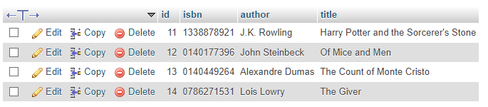

# Individual Assignment 4 - CRUD App
This project is a simple CRUD application. This application uses JPA for persistent data storage. 
- It requires XAMPP with Apache and MySQL running. 
	- The database name required is 'assignment4-crud'
- The Home page can be accessed via 
	- http://localhost:8080/book/all

## (C - Read - U - D)
The home page displays as the following:

This page will list all data currently stored in the database and allow you to search within the title, author, or ISBN columns. 

## (Create - R - U - D)
From the home page, you can click "Add a New Book" and be prompted to add the new book's information.

After clicking submit, you will be returned to the home screen with the new data added to the table. 

## (C - R - U - Delete)
To view details about an entry, you can click on the ID number from the list.

 It will display the details page, which will give you the option to edit or delete. If you choose delete, you will be returned to the book list. 

## (C - R - Update - D)
If you choose edit, you will be shown the book details in an editable form.

After saving, the entry will be updated in the table. 

The data stored will be persistent after closing the application, as they are stored in a MySQL database. 

